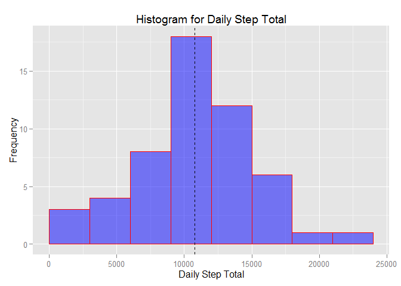
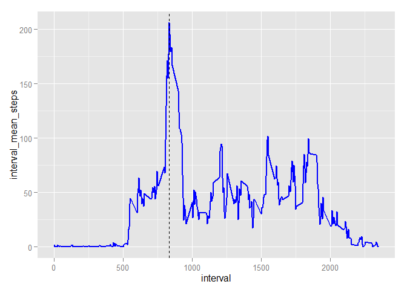
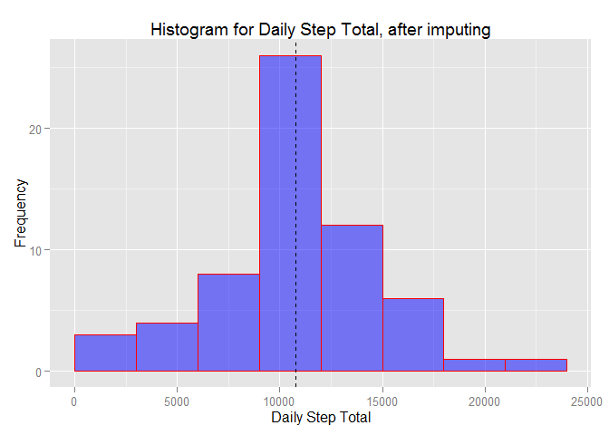
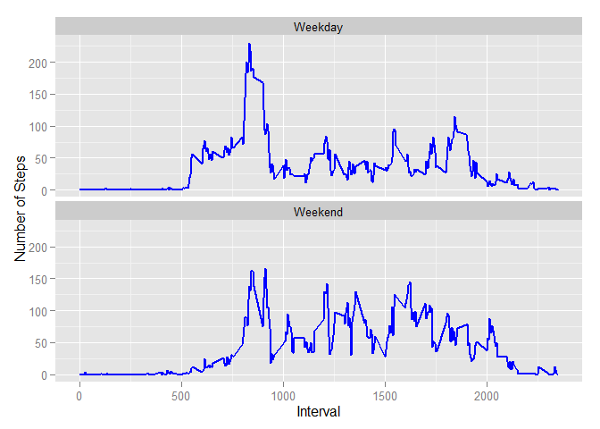

# Reproducible Research: Peer Assessment 1


##Introduction

It is now possible to collect a large amount of data about personal movement using activity monitoring devices such as a Fitbit, Nike Fuelband, or Jawbone Up. These type of devices are part of the "quantified self" movement - a group of enthusiasts who take measurements about themselves regularly to improve their health, to find patterns in their behavior, or because they are tech geeks. But these data remain under-utilized both because the raw data are hard to obtain and there is a lack of statistical methods and software for processing and interpreting the data.

This assignment makes use of data from a personal activity monitoring device. This device collects data at 5 minute intervals through out the day. The data consists of two months of data from an anonymous individual collected during the months of October and November, 2012 and include the number of steps taken in 5 minute intervals each day.

##Data

The data for this assignment can be downloaded from the course web site:

Dataset: Activity monitoring data
The variables included in this dataset are:

steps: Number of steps taking in a 5-minute interval (missing values are coded as NA)

date: The date on which the measurement was taken in YYYY-MM-DD format

interval: Identifier for the 5-minute interval in which measurement was taken

The dataset is stored in a comma-separated-value (CSV) file and there are a total of 17,568 observations in this dataset.

##Loading and preprocessing the data

The data is loaded as is, and subsequently transformed into a version in which N/A values are removed. The corresponding data objects are activity_raw_data and activity_data.


```r
setwd("C:/Users/avalsarajan/Desktop/Data Science/Coursera/5.Reproducible Research/Peer Assessment1")
activity_raw_data <- read.table('activity.csv',sep = ",",header = TRUE, na.strings ="NA",
                   colClasses = c('integer','Date','numeric'))
activity_data<- na.omit(activity_raw_data)
```

##Load libraries

The ggplot package will be used to create all plots. I am familiar with SQL, and will be the using the sqldf package for most data manipulations.


```r
library(ggplot2)
library(sqldf)
library(knitr)
```

##What is mean total number of steps taken per day?

1.) Calculate the total number of steps taken per day

2.) Make a histogram of the total number of steps taken each day

A SQL statement is used to aggregate the steps by date, and that data is stored in an object called daily_steps. The daily_steps data is then used in ggplot to make a historgram. The mean value of the steps is also plotted as a dotted black line on top of the Histogram.


```r
daily_steps<-sqldf('select date,sum(steps) as daily_step_total from activity_data group by 1')
```

```
## Loading required package: tcltk
```

```r
head(daily_steps)
```

```
##         date daily_step_total
## 1 2012-10-02              126
## 2 2012-10-03            11352
## 3 2012-10-04            12116
## 4 2012-10-05            13294
## 5 2012-10-06            15420
## 6 2012-10-07            11015
```

```r
ggplot(data=daily_steps, aes(daily_step_total)) + 
geom_histogram(breaks=seq(from=0, to=25000, by=3000),col="red", fill="blue",alpha=0.5 ) + 
labs(title="Histogram for Daily Step Total") +labs(x="Daily Step Total", y="Frequency") +
geom_vline(xintercept=mean(daily_steps$daily_step_total), linetype=2,color="black")
```

 

3.) Calculate and report the mean and median of the total number of steps taken per day


```r
mean(daily_steps$daily_step_total)
```

```
## [1] 10766.19
```

```r
median(daily_steps$daily_step_total)
```

```
## [1] 10765
```

The mean of daily total steps is 10766, and the median is 10765.

##What is the average daily activity pattern?

1.) Make a time series plot (i.e. type = "l") of the 5-minute interval (x-axis) and the average number of steps taken, averaged across all days (y-axis)

SQL is used again to aggregate the total steps by interval. A time series plot of the mean of the steps by interval is plotted, and the interval that has the maximum average steps is highlighted as a dashed black line on the plot.

```r
interval_steps<-sqldf('select interval,avg(steps) as interval_mean_steps from activity_data group by 1 order by interval asc')
ggplot(data=interval_steps, aes(interval,interval_mean_steps)) + 
geom_line(colour="blue", linetype=1, size=1) + 
geom_vline(linetype=2,xintercept = with(interval_steps, interval[interval_mean_steps== max(interval_mean_steps)]))
```

 

Which 5-minute interval, on average across all the days in the dataset, contains the maximum number of steps?

From the plot, as well from the code below, the interval that has the maximum mean steps is found to be interval 835.


```r
with(interval_steps, interval[interval_mean_steps== max(interval_mean_steps)])
```

```
## [1] 835
```

##Imputing missing values

Note that there are a number of days/intervals where there are missing values (coded as NA). The presence of missing days may introduce bias into some calculations or summaries of the data.

1.) Calculate and report the total number of missing values in the dataset (i.e. the total number of rows with NAs)


```r
sum(is.na(activity_raw_data$steps))
```

```
## [1] 2304
```

```r
sum(is.na(activity_raw_data$date))
```

```
## [1] 0
```

```r
sum(is.na(activity_raw_data$interval))
```

```
## [1] 0
```

The steps data element is the only one that has N/A values. It has 2304 values that are N/A's.

2.) Devise a strategy for filling in all of the missing values in the dataset. The strategy does not need to be sophisticated. For example, you could use the mean/median for that day, or the mean for that 5-minute interval, etc.

The strategy to fill the missing step values is to replace the N/A's with the mean of steps for that given interval. There are 288 intervals on any given date, and the means for these intervals were computed as part of the time-series exercise.These means will be used to replace N/A values in the steps, for the corresponding interval.

3.) Create a new dataset that is equal to the original dataset but with the missing data filled in

Two data sets are used in this solution. The first data set is the original raw data set, with the N/A values present. The second data set is a set of means for each interval where the steps data is not N/A. We will replace the N/A values by the corresponding interval mean, by using a simple, case statement that checks if the steps value is N/A or not.


```r
activity_data_imputed<-sqldf("select a.date,a.interval,
      case when a.steps is NULL then b.interval_mean_steps else a.steps end steps_imputed
      from activity_raw_data a
      inner join
      interval_steps b 
      on
      a.interval=b.interval")
```

4.) Make a histogram of the total number of steps taken each day and Calculate and report the mean and median total number of steps taken per day. Do these values differ from the estimates from the first part of the assignment? What is the impact of imputing missing data on the estimates of the total daily number of steps?

The code from the top half of this exercise is repurposed, with the only change being that the imputed data set is now the data source.


```r
daily_steps_imputed<-sqldf('select date,sum(steps_imputed) as daily_step_total from activity_data_imputed group by 1')
ggplot(data=daily_steps_imputed, aes(daily_step_total)) + 
geom_histogram(breaks=seq(from=0, to=25000, by=3000),col="red", fill="blue",alpha=0.5 ) + 
labs(title="Histogram for Daily Step Total, after imputing") +labs(x="Daily Step Total", y="Frequency") +
geom_vline(xintercept=mean(daily_steps$daily_step_total), linetype=2,color="black")
```

 

We calculate the mean and median values of the imputed data


```r
mean(daily_steps_imputed$daily_step_total)
```

```
## [1] 10766.19
```

```r
median(daily_steps_imputed$daily_step_total)
```

```
## [1] 10766.19
```

The mean of the imputed data set is the same as the one with N/A's removed. However, the median value has changed slightly, and has moved closer to the original mean value.

##Are there differences in activity patterns between weekdays and weekends?

1.) Create a new factor variable in the dataset with two levels - "weekday" and "weekend" indicating whether a given date is a weekday or weekend day.

First the weekdays() function to used to get the name of the Day for the date. Then a Case statement is used to determine if the Day is a weekend or a weekday. These additional data elements are added to the imputed data set.


```r
activity_data_imputed$day<-weekdays(activity_data_imputed$date)
activity_data_imputed<-sqldf('select a.*, case when a.day ="Saturday" or a.day ="Sunday" then "Weekend" else "Weekday" end day_type from activity_data_imputed a')
head(kable(activity_data_imputed,align=c('l','c','c','c','c')))
```

```
## [1] "date          interval    steps_imputed       day       day_type "
## [2] "-----------  ----------  ---------------  -----------  ----------"
## [3] "2012-10-01       0          1.7169811       Monday      Weekday  "
## [4] "2012-10-01       5          0.3396226       Monday      Weekday  "
## [5] "2012-10-01       10         0.1320755       Monday      Weekday  "
## [6] "2012-10-01       15         0.1509434       Monday      Weekday  "
```


2.) Make a panel plot containing a time series plot (i.e. type = "l") of the 5-minute interval (x-axis) and the average number of steps taken, averaged across all weekday days or weekend days (y-axis). See the README file in the GitHub repository to see an example of what this plot should look like using simulated data.

First a dataset is created that has the mean steps by interval and day type(weekend or weekday). A time series panel plot is created by day type, for the 5 minute intervals(x-axis) and average number of steps taken(y-axis). 


```r
interval_steps_daytype<-sqldf('select interval,day_type,avg(steps_imputed) as interval_mean_steps from activity_data_imputed group by 1,2 order by interval asc')
ggplot(data=interval_steps_daytype, aes(interval,interval_mean_steps)) + 
  geom_line(colour="blue", linetype=1, size=1) + facet_wrap(~ day_type,nrow=2) +
  labs(x="Interval", y="Number of Steps") 
```

 

To further understand the differences in activity level in Weekends vs Weekdays, a summary of statistics is performed by Day type grouping


```r
tapply(interval_steps_daytype$interval_mean_steps, interval_steps_daytype$day_type, summary)
```

```
## $Weekday
##    Min. 1st Qu.  Median    Mean 3rd Qu.    Max. 
##   0.000   2.247  25.800  35.610  50.850 230.400 
## 
## $Weekend
##    Min. 1st Qu.  Median    Mean 3rd Qu.    Max. 
##   0.000   1.241  32.340  42.370  74.650 166.600
```

```r
by(interval_steps_daytype$interval_mean_steps,interval_steps_daytype$day_type, sd)
```

```
## interval_steps_daytype$day_type: Weekday
## [1] 41.61918
## -------------------------------------------------------- 
## interval_steps_daytype$day_type: Weekend
## [1] 42.5439
```

It is observed that the weekends have a higher mean and median than weekdays.As the plot and summary stats show, the weekday data has a higher peak for the mean of steps by interval, peaking out at 230. The standard deviation in both groupings are fairly close.
